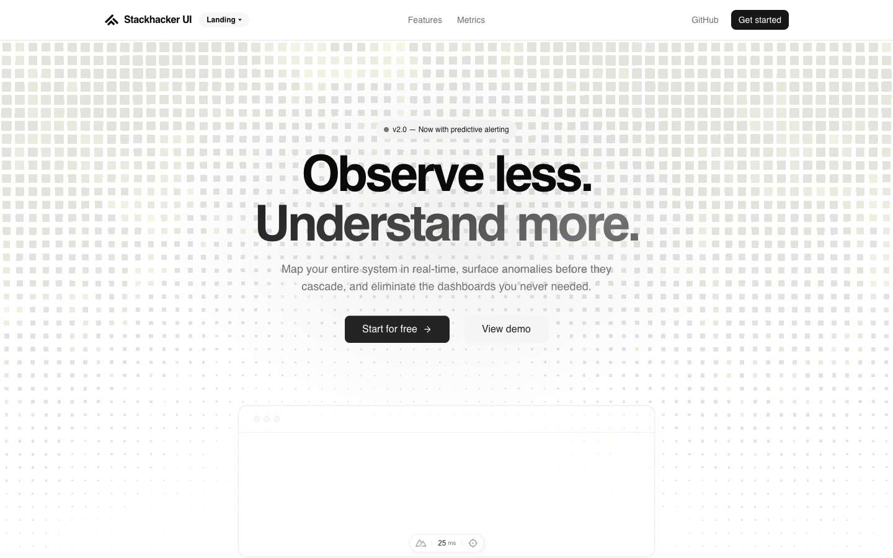

# Stackhacker UI Landing Template

[](https://nuxt.com)

Use this template to build a production-ready landing page with Nuxt 4, Nuxt Content, shadcn-vue, and Tailwind CSS v4.

- [Live demo](https://landing-template.stackhacker.io)
- [Documentation](https://ui.stackhacker.io/docs/getting-started)

<a href="https://landing-template.stackhacker.io" target="_blank">
  <picture>
    <source media="(prefers-color-scheme: dark)" srcset="public/screenshots/landing-dark.png">
    <source media="(prefers-color-scheme: light)" srcset="public/screenshots/landing-light.png">
    
  </picture>
</a>

## Quick Start

```bash
pnpm dlx nuxi@latest init my-app -t gh:stackhacker-ui/landing
```

## Deploy your own

[](https://vercel.com/new/clone?repository-name=landing&repository-url=https%3A%2F%2Fgithub.com%2Fstackhacker-ui%2Flanding&demo-image=https%3A%2F%2Flanding-template.stackhacker.io%2Fscreenshots%2Flanding-dark.png&demo-url=https%3A%2F%2Flanding-template.stackhacker.io%2F&demo-title=Stackhacker%20UI%20Landing%20Template&demo-description=A%20modern%20landing%20page%20template%20powered%20by%20Nuxt%20Content%2C%20shadcn-vue%2C%20and%20Tailwind%20CSS%20v4.)

## Setup

Make sure to install the dependencies:

```bash
pnpm install
```

## Development Server

Start the development server on `http://localhost:3000`:

```bash
pnpm dev
```

## Production

Build the application for production:

```bash
pnpm build
```

Locally preview production build:

```bash
pnpm preview
```

Check out the [deployment documentation](https://nuxt.com/docs/getting-started/deployment) for more information.

## Checks

Run the same checks as CI:

```bash
pnpm lint
pnpm typecheck
pnpm build
```

## Renovate integration

Install [Renovate GitHub app](https://github.com/apps/renovate/installations/select_target) on your repository and you are good to go.
